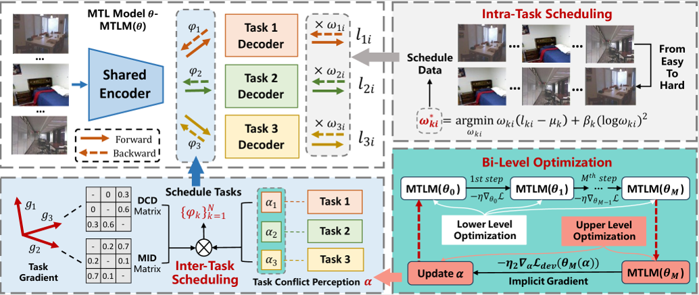

<h1 align="center">
Adaptive Data and Task Joint Scheduling for Multi-Task Learning 
	
IEEE International Conference on Data Engineering (ICDE) 2025
</h1>

## 🌟 Overview
- We propose DTJS, a novel adaptive Data and Task Joint Scheduling approach based on bi-level optimization for MTL, which mitigates performance degradation from the perspective of data and task co-scheduling.
- We propose intra-task scheduling that considers task-specific data difficulty to mitigate the negative influence of challenging data within each task, as well as inter-task scheduling that self-adaptively perceives the varying effects of task conflicts on different tasks and adjusts the training process to enhance joint training.
<div align="center">
  
  <p><i>The overall framework of DTJS. DTJS consists of intra-task scheduling, inter-task scheduling, and bi-level optimization. The MTL model parameter is updated during the lower-level optimization, and the learnable task conflict perception is optimized via upper-level optimization.</i></p>
</div>


## 📚 Citation Information
This is the code for the 2025 ICDE paper - Adaptive Data and Task Joint Scheduling for Multi-Task Learning

**If you find this work useful, citations to the following papers are welcome:**
```
@inproceedings{Liu25A,
	author       = {Zeyu Liu and
	Heyan Chai and
	Chaoyang Li and
	Lingzhi Wang and
	Qing Liao},
	title        = {Adaptive Data and Task Joint Scheduling for Multi-Task Learning},
	booktitle    = {41st {IEEE} International Conference on Data Engineering, {ICDE} 2025},
	publisher    = {{IEEE}},
	year         = {2025},
}
```
